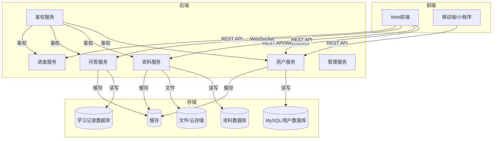

# 智能学习助手平台软件设计文档

## 1. 软件设计文档编写说明
本设计文档用于指导智能学习助手平台的详细设计与开发，面向开发、测试、运维等相关人员。文档结构参考标准SDS模板，内容涵盖系统架构、用例、类、数据、接口等详细设计。

## 2. 软件系统概述
智能学习助手平台为学习者提供学习资源管理、智能问答、学习进度追踪等一站式服务。系统支持多角色（普通用户、管理员），具备良好的可扩展性、安全性和兼容性。

## 3. 软件设计目标和原则
- 满足需求文档中所有功能与非功能需求
- 采用模块化、分层、微服务架构，便于扩展和维护
- 保证系统安全、性能和数据一致性
- 前后端分离，接口规范清晰
- 兼容多终端和主流浏览器

## 4. 软件设计约束和实现限制
- 需支持高并发访问，接口响应时间≤500ms
- 用户数据、资料需加密存储，防止泄露
- 需支持后续小程序、APP等多端扩展
- 采用主流技术栈（如Vue/React+Spring Boot/Node.js+MySQL/Redis）

## 5. 软件体系结构设计
### 5.1 总体架构
采用前后端分离+微服务架构，主要分为前端、后端服务、数据库/文件存储三大部分。

#### 架构图（Mermaid）

### 5.2 子系统/模块结构
- 用户与权限管理
- 学习资料管理
- 智能问答
- 学习进度追踪
- 管理与审核
- 安全与日志

## 6. 用户界面设计
- 注册/登录、资料上传、资料浏览/搜索、问答交互、进度展示、个人中心等页面
- 响应式设计，适配PC、平板、手机
- 主要界面流程图、原型图可后续补充

## 7. 子系统/构件设计
- 见5.2模块结构，每个模块独立开发、部署，接口通过REST API或WebSocket通信
- 典型子系统如资料服务、问答服务、进度服务等

## 8. 用例设计
详见需求文档与UML用例图，主要用例如下：
- 用户注册/登录
- 上传/下载/搜索学习资料
- 智能问答交互
- 查看/导出学习进度
- 管理员审核资料、管理用户

## 9. 类设计
详见UML类图，主要类包括：
- User（用户）
- Admin（管理员，继承User）
- Material（学习资料）
- QASession（问答会话）
- StudyRecord（学习记录）
- Progress（学习进度）

## 10. 数据设计
- 用户表（user）：id, username, password, email, phone, role, ...
- 资料表（material）：id, name, description, subject, file_path, file_type, upload_time, download_count, ...
- 问答表（qa_session）：id, user_id, question, answer, time, ...
- 学习记录表（study_record）：id, user_id, material_id, duration, start_time, end_time, ...
- 进度表（progress）：user_id, subject, percent, update_time, ...
- 采用MySQL存储结构化数据，文件存储采用本地或云存储

## 11. 接口设计
- 用户服务API：注册、登录、信息修改、权限校验等
- 资料服务API：上传、下载、搜索、编辑、删除、审核
- 问答服务API：提问、获取答案、历史记录、反馈
- 进度服务API：获取进度、导出记录、目标设定、提醒
- 管理服务API：用户管理、资料审核、日志查询
- 所有API采用RESTful风格，部分实时交互用WebSocket

## 12. 其他设计
- 日志与监控：统一日志系统，异常监控、性能监控
- 安全设计：接口鉴权、数据加密、防XSS/CSRF、文件检测
- 数据备份与恢复：定期自动备份，支持一键恢复

--- 