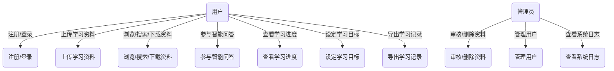
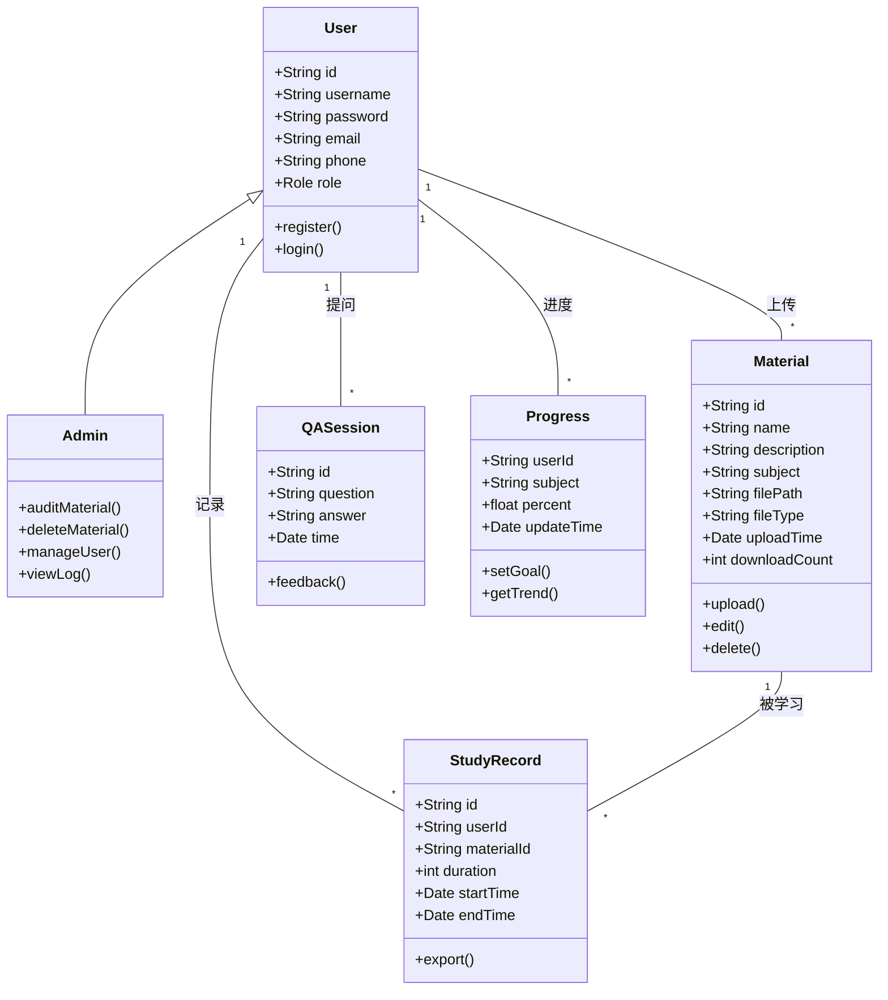
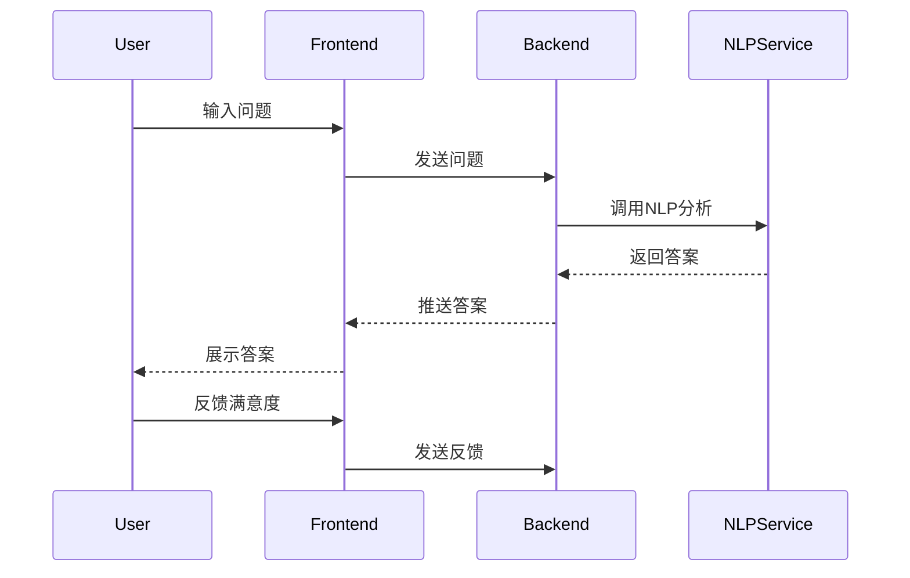
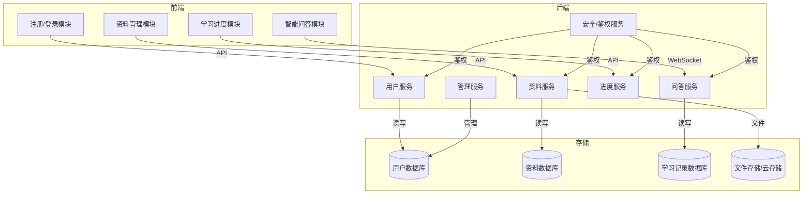

# 智能学习助手平台 UML 设计

## 1. 用例图

```mermaid
graph TD
  User(用户)
  Admin(管理员)
  RegLogin(注册/登录)
  Upload(上传学习资料)
  Browse(浏览/搜索/下载资料)
  QA(参与智能问答)
  Progress(查看学习进度)
  Goal(设定学习目标)
  Export(导出学习记录)
  Audit(审核/删除资料)
  ManageUser(管理用户)
  ViewLog(查看系统日志)

  User -- 注册/登录 --> RegLogin
  User -- 上传学习资料 --> Upload
  User -- 浏览/搜索/下载资料 --> Browse
  User -- 参与智能问答 --> QA
  User -- 查看学习进度 --> Progress
  User -- 设定学习目标 --> Goal
  User -- 导出学习记录 --> Export

  Admin -- 审核/删除资料 --> Audit
  Admin -- 管理用户 --> ManageUser
  Admin -- 查看系统日志 --> ViewLog
```

## 2. 类图

```mermaid
classDiagram
  class User {
    +String id
    +String username
    +String password
    +String email
    +String phone
    +Role role
    +register()
    +login()
  }
  class Admin {
    +auditMaterial()
    +deleteMaterial()
    +manageUser()
    +viewLog()
  }
  class Material {
    +String id
    +String name
    +String description
    +String subject
    +String filePath
    +String fileType
    +Date uploadTime
    +int downloadCount
    +upload()
    +edit()
    +delete()
  }
  class QASession {
    +String id
    +String question
    +String answer
    +Date time
    +feedback()
  }
  class StudyRecord {
    +String id
    +String userId
    +String materialId
    +int duration
    +Date startTime
    +Date endTime
    +export()
  }
  class Progress {
    +String userId
    +String subject
    +float percent
    +Date updateTime
    +setGoal()
    +getTrend()
  }
  User <|-- Admin
  User "1" -- "*" Material : 上传
  User "1" -- "*" QASession : 提问
  User "1" -- "*" StudyRecord : 记录
  User "1" -- "*" Progress : 进度
  Material "1" -- "*" StudyRecord : 被学习
```

## 3. 时序图（用户智能问答流程）

```mermaid
sequenceDiagram
  participant User
  participant Frontend
  participant Backend
  participant NLPService
  User->>Frontend: 输入问题
  Frontend->>Backend: 发送问题
  Backend->>NLPService: 调用NLP分析
  NLPService-->>Backend: 返回答案
  Backend-->>Frontend: 推送答案
  Frontend-->>User: 展示答案
  User->>Frontend: 反馈满意度
  Frontend->>Backend: 发送反馈
```

## 4. 组件图

```mermaid
graph TD
  subgraph 前端
    FE1[注册/登录模块]
    FE2[资料管理模块]
    FE3[智能问答模块]
    FE4[学习进度模块]
  end
  subgraph 后端
    BE1[用户服务]
    BE2[资料服务]
    BE3[问答服务]
    BE4[进度服务]
    BE5[管理服务]
    BE6[安全/鉴权服务]
  end
  subgraph 存储
    DB1[(用户数据库)]
    DB2[(资料数据库)]
    DB3[(学习记录数据库)]
    FS[(文件存储/云存储)]
  end
  FE1-->|API|BE1
  FE2-->|API|BE2
  FE3-->|WebSocket|BE3
  FE4-->|API|BE4
  BE1-->|读写|DB1
  BE2-->|读写|DB2
  BE3-->|读写|DB3
  BE2-->|文件|FS
  BE5-->|管理|DB1
  BE6-->|鉴权|BE1
  BE6-->|鉴权|BE2
  BE6-->|鉴权|BE3
  BE6-->|鉴权|BE4
``` 